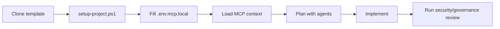
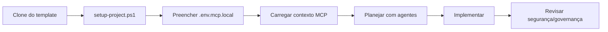

# Project : Heart Failure ds Showcase 
# Data Science Showcase Project: Heart Failure Analysis with Interactive Dashboard
________________________________________
This project is a complete Data Science portfolio demonstrating essential skills: collection, exploratory analysis, pre-processing, modeling (classification and clustering), interpretability with SHAP and deploy in an interactive dashboard with Streamlit.
The differential is in integrating multiple techniques into a single flow, with rich visualizations and a user-friendly interface for data exploration and results.
________________________________________
# 🧠 Demonstrated Skills
  • Data manipulation: pandas, numpy
  • Visualization: matplotlib, seaborn, plotly
  • Pre-processing: missing, scaling, encoding treatment
  • Modeling: logistic regression, random forest, XGBoosting (performance comparison)
  • Evaluation: metrics (accuracy, precision, recall, F1, ROC-AUC), confusion matrix, ROC curve
  • Clustering: K-Means, dimensional reduction with PCA
  • Interpretability: SHAP to explain individual predictions and global importance
  • Deploy: interactive application with Streamlit
  • Project organization: modular structure, reusable and documented

# 🔍 Visão Geral do Projeto

1. Dados
  •	Fonte: Kaggle - Heart Failure Clinical Records
  •	Descrição: 299 pacientes com insuficiência cardíaca, 13 características clínicas e um alvo binário (óbito durante o período de acompanhamento).
  •	Features: idade, anemia, creatinofosfoquinase, diabetes, fração de ejeção, pressão alta, plaquetas, creatinina sérica, sódio sérico, sexo, tabagismo, tempo de acompanhamento.

2. Pipeline Implementado
  •	Carregamento e validação dos dados.
  •	Análise exploratória interativa (distribuições, boxplots, matriz de correlação).
  •	Pré-processamento: padronização das features numéricas (StandardScaler).
  •	Modelos supervisionados:
    o	Regressão Logística
    o	Random Forest
    o	XGBoost
    o	Comparação de métricas e seleção do melhor modelo (Random Forest geralmente tem melhor performance).
  •	Clusterização não supervisionada com K-Means (2 a 5 clusters) e visualização dos perfis.
  •	Interpretabilidade com SHAP: importância global das features e explicação local para novas predições.

3. Pipeline Implementado
  •	Carregamento e validação dos dados.
  •	Análise exploratória interativa (distribuições, boxplots, matriz de correlação).
  •	Pré-processamento: padronização das features numéricas (StandardScaler).
  •	Modelos supervisionados:
    o	Regressão Logística
    o	Random Forest
    o	XGBoost
    o	Comparação de métricas e seleção do melhor modelo (Random Forest geralmente tem melhor performance).
  •	Clusterização não supervisionada com K-Means (2 a 5 clusters) e visualização dos perfis.
  •	Interpretabilidade com SHAP: importância global das features e explicação local para novas predições.

5. Dashboard Streamlit
O aplicativo é dividido em quatro abas:

📊 Exploração dos Dados
  •	Visão geral do dataset (estatísticas descritivas, valores faltantes).
  •	Gráficos interativos com Plotly:
    o	Histogramas de todas as variáveis (selecionáveis)
    o	Boxplots por grupo (target)
    o	Matriz de correlação heatmap
  
🤖 Modelos Preditivos
  •	Comparação de desempenho (gráfico de barras das métricas)
  •	Matriz de confusão (para o modelo selecionado)
  •	Curva ROC com AUC
  •	Importância das features (para Random Forest)

🔬 Clusterização
  •	Escolha do número de clusters via método Elbow (inércia)
  •	Visualização dos clusters em 2D (PCA)
  •	Perfil médio de cada cluster (radar chart)

🩺 Preditor Interativo
  •	Formulário para inserir os dados de um novo paciente
  •	Escolha do modelo (Random Forest ou XGBoost)
  •	Predição da probabilidade de óbito
  •	Gráfico SHAP waterfall explicando a contribuição de cada feature para a predição


# This project uses the template - default-template-ai-projects - GitHub : https://github.com/BettoEsteves/default-template-ai-projects
<p align="center">
  <a href="#"></a>
  <a href="#"></a>
  <a href="#"></a>
  <a href="#"></a>
</p>

---

## 🇺🇸 English

Governed, AI-first template to kickstart projects with high productivity, code quality, CI/CD automation, IaC, and MCP-enabled IDE context.

> [!IMPORTANT]
> This template enforces the right flow: **plan with context first, then implement**.

### Quick Navigation (EN)
- [What this template provides](#en-what-this-template-provides)
- [Visual flow](#en-visual-flow)
- [30-second demo](#en-30-second-demo)
- [Clone folder name vs PROJECT_NAME](#en-clone-folder-name-vs-project_name)
- [Quickstart](#en-quickstart)
- [Recommended first AI prompt](#en-recommended-first-ai-prompt)
- [MCP and project customization](#en-mcp-and-project-customization)
- [Standard agent workflow](#en-standard-agent-workflow)
- [Mandatory governance](#en-mandatory-governance)
- [Quality, CI/CD, and security](#en-quality-cicd-and-security)
- [Useful commands](#en-useful-commands)
- [FAQ](#en-faq)
- [Português](#pt-br-português)

<a id="en-what-this-template-provides"></a>
### What this template provides
- A single structure for Python, R/Posit, and Rust.
- Governance from day zero.
- Compatibility with AI IDEs (Cursor, VS Code/Copilot, Zed, Trae, Replit).
- CI/CD and security baseline already prepared.
- MCP integrations for Jira, Azure DevOps, Figma, and Notion.
- Guided bootstrap with mandatory `PROJECT_NAME` per project.

<a id="en-visual-flow"></a>
### Visual flow


<a id="en-30-second-demo"></a>
### 30-second demo
```bash
git clone https://github.com/BettoEsteves/default-template-ai-projects.git
cd default-template-ai-projects
pwsh -File infra/ci/setup-project.ps1
docker compose --profile mcp --env-file .env.mcp.local -f infra/ci/docker-compose.mcp.yml up -d
```

> [!NOTE]
> Docker MCP is optional and requires real provider images in `.env.mcp.local` (`*_MCP_IMAGE`).
> If you keep placeholder values (`replace-with-your-org`), `docker compose` will fail by design.

<a id="en-clone-folder-name-vs-project_name"></a>
### Clone folder name vs `PROJECT_NAME` (very important)
- `git clone ...` without an extra name creates the default local folder `default-template-ai-projects`.
- `PROJECT_NAME` is different: it is the logical identity used inside `.env.mcp.local`.
- You can keep the default folder name and still use a custom `PROJECT_NAME`.

Keep default folder name:
```bash
git clone https://github.com/BettoEsteves/default-template-ai-projects.git
cd default-template-ai-projects
pwsh -File infra/ci/setup-project.ps1
```

Clone with a custom folder name:
```bash
git clone https://github.com/BettoEsteves/default-template-ai-projects.git my-new-project
cd my-new-project
pwsh -File infra/ci/setup-project.ps1 -ProjectName my-new-project
```

<a id="en-quickstart"></a>
### Quickstart
1. Clone and open the repository in your AI IDE.
2. Run bootstrap:
   - `pwsh -File infra/ci/setup-project.ps1`
3. Provide a real `PROJECT_NAME`.
4. Fill remaining values in `.env.mcp.local`.
5. (Optional) Start MCP with Docker:
   - `docker compose --profile mcp --env-file .env.mcp.local -f infra/ci/docker-compose.mcp.yml up -d`
6. Read governance files in this order:
   - `.ai/PROJECT_STRUCTURE.md`
   - `.ai/AGENT_CONTRACT.md`
   - `.ai/rules.md`
   - `.ai/STRUCTURE_CHECKLIST.md`
7. Ask AI to plan first and approve the plan before implementation.

<a id="en-recommended-first-ai-prompt"></a>
### Recommended first AI prompt
"Read and apply the following as mandatory context: `.ai/PROJECT_STRUCTURE.md`, `.ai/AGENT_CONTRACT.md`, `.ai/rules.md`, `.ai/STRUCTURE_CHECKLIST.md`, `docs/TEMPLATE_USAGE.md`, `docs/VibeCodingAgent.md`, `docs/MCP_Jira_Azure_Setup.md`. Then load Jira/Azure/Figma/Notion context through MCP, propose an execution plan with acceptance criteria, risks, and validation. Do not implement code before plan approval."

<a id="en-mcp-and-project-customization"></a>
### MCP and project customization
- Mandatory `PROJECT_NAME` in `.env.mcp.local`.
- MCP tokens and identifiers per user/team.
- `.env.mcp.local` is not versioned.

Key files:
- `.env.mcp.example`
- `.cursor/mcp.json`
- `infra/ci/setup-project.ps1`
- `infra/ci/docker-compose.mcp.yml`

<a id="en-standard-agent-workflow"></a>
### Standard agent workflow
1. Load work-item context:
   - `.github/agents/jira-workflow.agent.md`
   - `.github/agents/azure-devops-workflow.agent.md`
2. Load design/documentation context (Figma/Notion via MCP).
3. Plan with `.github/agents/task-planner.agent.md`.
4. Implement with `.github/agents/swe-implementer.agent.md`.
5. Run security review with `.github/agents/security-reviewer.agent.md`.
6. For IaC, also use `.github/agents/terraform-iac-reviewer.agent.md`.

<a id="en-mandatory-governance"></a>
### Mandatory governance
Mandatory files:
- `.ai/PROJECT_STRUCTURE.md`
- `.ai/AGENT_CONTRACT.md`
- `.ai/rules.md`
- `.ai/STRUCTURE_CHECKLIST.md`

Essential rules:
- Do not create files outside governed structure without formal update.
- Do not track `results/`, `logs/`, or `tests/scripts/`.
- Update docs/checklist when behavior, policy, or structure changes.

<a id="en-quality-cicd-and-security"></a>
### Quality, CI/CD, and security
- Main workflow: `.github/workflows/ci.yml`
- Security workflow: `.github/workflows/security.yml`
- Terraform baseline: `fmt`, `init -backend=false`, `validate`
- Python tests: `unit`, `integration`, `e2e`
- Dependency automation: `.github/dependabot.yml`
- Security tooling: `pip-audit`, `detect-secrets`, `CodeQL`

<a id="en-useful-commands"></a>
### Useful commands
- Bootstrap locally: `pwsh -File infra/ci/setup-project.ps1`
- Start MCP with Docker: `docker compose --profile mcp --env-file .env.mcp.local -f infra/ci/docker-compose.mcp.yml up -d`
- Stop MCP with Docker: `docker compose --profile mcp --env-file .env.mcp.local -f infra/ci/docker-compose.mcp.yml down`
- Python tests (no e2e): `pytest -m "not e2e"`
- Terraform checks: `terraform -chdir=infra/terraform fmt -check -recursive && terraform -chdir=infra/terraform init -backend=false && terraform -chdir=infra/terraform validate`

<a id="en-faq"></a>
### FAQ
**1) Do I need to manually edit files before starting?**
- Only `.env.mcp.local` (generated by script). Everything else is already prepared.

**2) Is `PROJECT_NAME` really mandatory?**
- Yes. Every project should define its own name for context and traceability.

**3) Can I use this template without Docker?**
- Yes. Docker for MCP is optional.

**4) Can I ask AI to code immediately?**
- Not recommended. Ask for a plan with acceptance criteria and risks first.

---

## 🇧🇷 Português

<a id="pt-br-português"></a>
Template governado e AI-first para iniciar projetos com produtividade alta, qualidade de código, CI/CD automatizado, IaC e contexto operacional para IDEs com IA.

> [!IMPORTANT]
> Este template força o fluxo correto: **primeiro planejar com contexto, depois implementar**.

### Navegação rápida (PT-BR)
- [O que este template entrega](#pt-o-que-este-template-entrega)
- [Fluxo visual](#pt-fluxo-visual)
- [Demo rápida (30 segundos)](#pt-demo-rápida-30-segundos)
- [Nome da pasta clonada vs PROJECT_NAME](#pt-nome-da-pasta-clonada-vs-project_name)
- [Início rápido](#pt-início-rápido)
- [Prompt inicial recomendado para IA](#pt-prompt-inicial-recomendado-para-ia)
- [MCP e personalização por projeto](#pt-mcp-e-personalização-por-projeto)
- [Fluxo padrão de agentes](#pt-fluxo-padrão-de-agentes)
- [Governança obrigatória](#pt-governança-obrigatória)
- [Qualidade, CI/CD e segurança](#pt-qualidade-cicd-e-segurança)
- [Comandos úteis](#pt-comandos-úteis)
- [FAQ](#pt-faq)

<a id="pt-o-que-este-template-entrega"></a>
### O que este template entrega
- Estrutura única para Python, R/Posit e Rust.
- Governança obrigatória desde o primeiro commit.
- Compatibilidade com IDEs com IA (Cursor, VS Code/Copilot, Zed, Trae, Replit).
- CI/CD e segurança já preparados.
- MCP para Jira, Azure DevOps, Figma e Notion.
- Bootstrap guiado com `PROJECT_NAME` obrigatório por projeto.

<a id="pt-fluxo-visual"></a>
### Fluxo visual


<a id="pt-demo-rápida-30-segundos"></a>
### Demo rápida (30 segundos)
```bash
git clone https://github.com/BettoEsteves/default-template-ai-projects.git
cd default-template-ai-projects
pwsh -File infra/ci/setup-project.ps1
docker compose --profile mcp --env-file .env.mcp.local -f infra/ci/docker-compose.mcp.yml up -d
```

> [!NOTE]
> Docker MCP é opcional e requer imagens reais de provedores no `.env.mcp.local` (`*_MCP_IMAGE`).
> Se você mantiver os placeholders (`replace-with-your-org`), o `docker compose` falhará por design.

<a id="pt-nome-da-pasta-clonada-vs-project_name"></a>
### Nome da pasta clonada vs `PROJECT_NAME` (muito importante)
- `git clone ...` sem nome extra cria a pasta local padrão `default-template-ai-projects`.
- `PROJECT_NAME` é outro conceito: é a identidade lógica no `.env.mcp.local`.
- Você pode manter a pasta padrão e ainda definir outro `PROJECT_NAME`.

Exemplo mantendo o nome padrão da pasta:
```bash
git clone https://github.com/BettoEsteves/default-template-ai-projects.git
cd default-template-ai-projects
pwsh -File infra/ci/setup-project.ps1
```

Exemplo já clonando com nome de pasta personalizado:
```bash
git clone https://github.com/BettoEsteves/default-template-ai-projects.git meu-novo-projeto
cd meu-novo-projeto
pwsh -File infra/ci/setup-project.ps1 -ProjectName meu-novo-projeto
```

<a id="pt-início-rápido"></a>
### Início rápido
1. Clone e abra o repositório na sua IDE com IA.
2. Execute o bootstrap:
   - `pwsh -File infra/ci/setup-project.ps1`
3. Informe um `PROJECT_NAME` real.
4. Complete os campos pendentes no `.env.mcp.local`.
5. (Opcional) Suba MCP via Docker:
   - `docker compose --profile mcp --env-file .env.mcp.local -f infra/ci/docker-compose.mcp.yml up -d`
6. Leia os arquivos de governança nesta ordem:
   - `.ai/PROJECT_STRUCTURE.md`
   - `.ai/AGENT_CONTRACT.md`
   - `.ai/rules.md`
   - `.ai/STRUCTURE_CHECKLIST.md`
7. Peça para a IA planejar primeiro e só depois aprove implementação.

<a id="pt-prompt-inicial-recomendado-para-ia"></a>
### Prompt inicial recomendado para IA
"Leia e aplique como contexto obrigatório: `.ai/PROJECT_STRUCTURE.md`, `.ai/AGENT_CONTRACT.md`, `.ai/rules.md`, `.ai/STRUCTURE_CHECKLIST.md`, `docs/TEMPLATE_USAGE.md`, `docs/VibeCodingAgent.md`, `docs/MCP_Jira_Azure_Setup.md`. Em seguida, carregue contexto de Jira/Azure/Figma/Notion via MCP, proponha plano de execução com critérios de aceite, riscos e validação. Não implemente código antes da aprovação do plano."

<a id="pt-mcp-e-personalização-por-projeto"></a>
### MCP e personalização por projeto
- `PROJECT_NAME` obrigatório no `.env.mcp.local`.
- Tokens e identificadores MCP por usuário/time.
- `.env.mcp.local` não é versionado.

Arquivos principais:
- `.env.mcp.example`
- `.cursor/mcp.json`
- `infra/ci/setup-project.ps1`
- `infra/ci/docker-compose.mcp.yml`

<a id="pt-fluxo-padrão-de-agentes"></a>
### Fluxo padrão de agentes
1. Carregar contexto de work items:
   - `.github/agents/jira-workflow.agent.md`
   - `.github/agents/azure-devops-workflow.agent.md`
2. Carregar contexto de design/documentação (Figma/Notion via MCP).
3. Planejar com `.github/agents/task-planner.agent.md`.
4. Implementar com `.github/agents/swe-implementer.agent.md`.
5. Revisar segurança com `.github/agents/security-reviewer.agent.md`.
6. Para IaC, usar também `.github/agents/terraform-iac-reviewer.agent.md`.

<a id="pt-governança-obrigatória"></a>
### Governança obrigatória
Arquivos mandatórios:
- `.ai/PROJECT_STRUCTURE.md`
- `.ai/AGENT_CONTRACT.md`
- `.ai/rules.md`
- `.ai/STRUCTURE_CHECKLIST.md`

Regras essenciais:
- Não criar arquivos fora da estrutura governada sem atualização formal.
- Não versionar `results/`, `logs/` ou `tests/scripts/`.
- Atualizar docs/checklist quando comportamento, política ou estrutura mudar.

<a id="pt-qualidade-cicd-e-segurança"></a>
### Qualidade, CI/CD e segurança
- Workflow principal: `.github/workflows/ci.yml`
- Workflow de segurança: `.github/workflows/security.yml`
- Terraform baseline: `fmt`, `init -backend=false`, `validate`
- Testes Python: `unit`, `integration`, `e2e`
- Dependências: `.github/dependabot.yml`
- Segurança: `pip-audit`, `detect-secrets`, `CodeQL`

<a id="pt-comandos-úteis"></a>
### Comandos úteis
- Validar bootstrap local: `pwsh -File infra/ci/setup-project.ps1`
- Subir MCP no Docker: `docker compose --profile mcp --env-file .env.mcp.local -f infra/ci/docker-compose.mcp.yml up -d`
- Parar MCP no Docker: `docker compose --profile mcp --env-file .env.mcp.local -f infra/ci/docker-compose.mcp.yml down`
- Rodar testes Python (sem e2e): `pytest -m "not e2e"`
- Rodar validação Terraform: `terraform -chdir=infra/terraform fmt -check -recursive && terraform -chdir=infra/terraform init -backend=false && terraform -chdir=infra/terraform validate`

<a id="pt-faq"></a>
### FAQ
**1) Preciso editar arquivo manualmente antes de começar?**
- Só o `.env.mcp.local` (gerado pelo script). O restante já vem preparado.

**2) O `PROJECT_NAME` é obrigatório mesmo?**
- Sim. Cada projeto deve definir um nome próprio para contexto e rastreabilidade.

**3) Se eu não usar Docker, consigo usar o template?**
- Sim. Docker para MCP é opcional.

**4) Posso pedir código para a IA imediatamente?**
- Não é recomendado. Primeiro peça plano com critérios de aceite e riscos.
